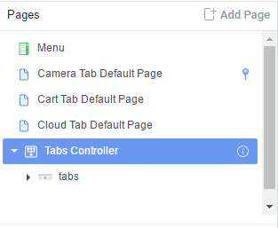

[TOC]

# ionic creator研究

- **目的** 研究学习ionic creator web的结构、使用到的技术、是如何创建ionic APP。
- **网址** https://creator.ionic.io/app/login
- **前提条件** 需要创建一个ionic账户。免费。

## 用到的第三方插件
  - jquery: 不解释。
  - bootstrap: 不解释。
  - angular系列: angular.js、angular-animate.js、angular-cookies.js、angular-resource.js、angular-sanitize.js、angular-ui-router.js、angularjs-color-picker。
  - [mixpanel](https://mixpanel.com): 跟踪用户操作，而非页面浏览量
  - [analytics](http://www.google.cn/intl/zh-CN_ALL/analytics/learn/index.html): 网站流量分析工具。不只记录点击流数据，更注重点击流的分析与测量；并尽量将这些结果向Web分析和网络营销引导
  - [filepicker](https://www.filestack.com): 文件上传。**通过嵌入iframe来实现。**
      页面中链接的是`https://dialog.filepicker.io/dialog/comm_iframe/`和`https://www.filepicker.io/dialog/comm_iframe/`
  - [Modernizr](): 基于访客浏览器的不同（指对新标准支持性的差异）而开发不同级别体验的设计师的工作变得更为简单。它使得设计师可以在支持HTML5和CSS3的浏览器中充分利用HTML5和CSS3的特性进行开发，同时又不会牺牲其他不支持这些新技术的浏览器的控制。
  - [handlebars](http://handlebarsjs.com/): 将后台传来的json内容，优雅地转换为html代码。
  - [lodash](https://lodash.com/): Lamda化代码，类似于RxJava。
  - [rangy-core.js](https://code.google.com/p/rangy/): 用来获取用户鼠标选中的内容。
  - beautify-html: 对html代码进行格式化。
  - collide: 碰撞处理。
  - [markdown.js](https://github.com/evilstreak/markdown-js): 将md格式转为html。
  - [select2](https://select2.github.io/): 下拉列表框、搜索处理。
  - [ace](https://ace.c9.io/#nav=about): 基于Web的代码编辑器。
  - [keymaster](https://github.com/madrobby/keymaster): 用来实现键盘快捷方式的绑定处理，无需依赖其他第三方 JS 库。
  - [color-polyfill]: ?
  - [md5]:
  - [tinycolor](http://bgrins.github.io/TinyColor/): 颜色解析操作。
  - [ngsmoothscroll](https://github.com/d-oliveros/ngSmoothScroll): directives to scroll smoothly to an element with easing.


## 使用到的第三方技术
- [Intercom](https://www.intercom.io/): 社会化客户关系管理平台，致力于帮助公司更好地与客户交流。
- [stripe](https://stripe.com/docs/stripe.js): 在线支付。**通过嵌入iframe来实现。**

## 主界面结构
 主要由三部分组成：左侧分上下两部分：上面为App页面结构(Pages)、下面为页面组件(Components)；中间为编辑区和预览区；右侧为组件属性设置。
   下面是视图大的结构:
   ```
   <head>
       <meta charset="UTF-8">
       <title>演示</title>
       <style type="text/css">
           .table-ftw {
               display: table;
              height: 100%;
               width: 100%;
               position: relative;
               table-layout: fixed; }
           .table-ftw .tr-ftw {
               display: table-row; }
           .table-ftw .tr-ftw .td-ftw {
               display: table-cell;
               position: relative;
               vertical-align: top;
               height: 100%; }
           .table-ftw .tr-ftw .td-ftw .scroll-outer {
               height: 100%;
               width: 100%;
               position: relative;
               overflow-y: auto;
               overflow-x: hidden; }
           .table-ftw .tr-ftw .td-ftw .scroll-outer .scroll-inner {
               height: 100%;
               position: absolute; }


           #props, #components {
               width: 315px;
               min-width: 315px;
               height: 100%; }

           .laj-toolbar{
               background: yellow;
           }
           .laj-side-left{
               background: greenyellow;
           }
           .laj-edit-zone{
               background: gold;
           }
           .laj-side-right{
               background: greenyellow;
           }
       </style>
   </head>
   <body>
   <!-- uiView: 整个View视图 -->
   <div id="main" style="position:relative;" ui-view="" class="">
       <!-- 整个视图是一个Table结构-->
       <div class="table-ftw">
           <!-- 第一行：标题栏-->
           <div class="tr-ftw laj-toolbar">
               <div class="td-ftw" style="height:48px;">顶部标题栏
               </div>
           </div>
       </div>
       <div class="tr-ftw">
           <div class="td-ftw">
               <div id="wrapper" class="table-ftw">
                   <div class="tr-ftw">
                       <!-- uiView:  -->
                       <div class="td-ftw" ui-view="">
                           <!-- ngIf: showDesigner -->
                           <div ng-if="showDesigner" id="designer" class="table-ftw design" ng-class="designer.getMode()">
                               <div class="tr-ftw">
                                   <!-- 左侧边栏 -->
                                   <div id="components" class="sidebar td-ftw laj-side-left"
                                        ng-if-nope="designer.getMode() == &#39;design&#39;">左侧边栏</div>
                                   <!-- 中间编辑区 -->
                                   <div id="canvas" class="td-ftw scroll-outer laj-edit-zone">编辑区</div>
                                   <!-- 右侧边栏 -->
                                   <div id="props" class="sidebar td-ftw laj-side-right" ng-controller="PropsCtrl"
                                        ng-if-nope="designer.getMode() == &#39;design&#39;">
                                       右侧边栏
                                   </div>
                               </div>
                           </div>
                       </div>
                   </div>
               </div>
           </div>
       </div>
   </div>
   </body>
   ```
   从以上代码可见，整个布局是通过display: table等css值构建的table布局。

   视图中的js操作基本位于ionic-creator.js文件中。

   在编辑区，引用的一个iframe，指向frame.html，这个frame.html中使用的ng-app为`ionic.creator.frameApp`

### 左侧Pages面板及与编辑区的交互
1. 左侧面板

    如下图，具有以下功能:  
		

    - 显示App中的所有页面
    - 点击某项在编辑区显示此页面的内容
    - 添加/删除页面

    下面介绍几个函数：
    ```
    o.select = function (event, id) {
        var n, r = Designer.getById(id);
        if (r) {
            r.isPage && o.selectPage(r), Designer.selectById(id);
            for (var l = Array.prototype.slice.call(a[0].querySelectorAll(".selected")), s = 0;
                s < l.length; s++)
                $(l[s]).removeClass("selected");
            n = $(event.target).closest("li"), n.addClass("selected")
        }
    },
    ```

    - 点击切换编辑区内容的操作
      点击时调用select($event, 'page2')函数，page2为

## 自定义指令
- autofocus
- toggle
- contenteditable
- uiSrefActiveIf
- select2
- appStatus
- appComponents
- focusMe
- formErrors
- appPreview
- livePreview
- appOutline
- pageTemplates
- componentProperties
- toggle
- propertyList
- propertyBoolean
- propertyButton
- propertyClass
- propertyThemeColor
- propertyThemeColorAllowNone
- propertyColorPicker
- propertyDimension
- propertyEditor
- helpIcon
- propertyHtml
- propertyIcon
- propertyPages
- propertyInt
- propertyMargin
- propertyMove
- propertyRadius
- propertyRoute
- propertyDefaultpage
- propertySize
- propertyString
- propertyTextlist
- propertySlashurl
- propertyUrl
- propertyUrlupload
- propertyAndroidWebfont
- propertyIosWebfont
- propertyFontWeight
- filesModel

## 自定义Factory
- ButtonComponent
- ListItemThumbnailComponent
- Document
- DocumentExporter
- DocumentIterator
- DocumentRenderer
- ABTesting
- IconSplashModal
- MoveModal
- Plans
- PaywallModal
- PlansModal
- Share
- ShareModal
- TeamAdd
- TeamInvite
- Themes
- ThemesModal
- Coupon
- Project
- SecurityProfile
- SecurityCredential
- Team
- User
- IconSet
- PropertyRenderer
- **Designer**
- DragHandler
- DropHandler
- FrameCoords
- Exporter
- Features
- FirstRun
- StandardModal
- PageTemplates
- ProjectDialog
- Projects
- Shortcuts
- Stats
- Tutorials


## 自定义Controller
- NavCtrl
- MainCtrl
- FirstRunCtrl
- DesignerCtrl
- AppCtrl
- LoginCtrl
- SignupCtrl
- LogoutCtrl
- ForgotPasswordCtrl
- PropsCtrl
- AppSettingsCtrl
- PreviewCtrl
- SupportCtrl
- DashboardCtrl
- DashboardPaymentCtrl
- UpgradeCtrl
- DashboardProjectsCtrl
- DashboardTeamsCtrl
- DashboardTeamCtrl
- DashboardTeamInviteCtrl
- DashboardAddTeamCtrl
- DashboardHelpCtrl
- DashboardHelpIndexCtrl
- DashboardHelpVideosCtrl
- DashboardHelpSupportCtrl
- DashboardProfileCtrl
- DashboardProfileEditCtrl
- DashboardProfilePasswordCtrl
- DashboardProfileBillingCtrl
- LoadErrorCtrl
-


## 自定义provider
- djangoCsrf
- ComponentTypesProvider: 组件Provider，提供按钮、Card、RadioButton等组件。
- Action: undo、redo管理器。
- Config

## 常量
- NodeType
-

## module: ionic.creator.components
1. factory:
   - ComponentTemplate
   - ComponentFactory

1. provider:
   - ComponentTypes:

## 事件
- drag.start、drag.end
- component.dropped
- component.redraw


## 扫盲
1. iframe点滴

   摘自http://www.zhihu.com/question/20653055

 - iframe 等于新建了一个全新的，不受 parent 影响的页面上下文，所以在一定程度上，类似于沙箱隔离（sandbox）。
 - 替代方案一般就是动态语言的 include 机制、ajax 动态填充内容，以及以后会普及的contentEditable。
 - 如果你需要独立的浏览上下文，那么就用 iframe，否则就不用。（HTML规范）
 - 现在，应该使用 iframe 的例子如：
   1. 沙箱隔离。
   1. 引用第三方内容。
   1. 独立的带有交互的内容，比如幻灯片。
   1. 需要保持独立焦点和历史管理的子窗口，如复杂的Web应用。
   1. **在移动端用于从网页调起客户端应用**（此方法在iphone上并不安全，慎用！具体风险看这里 iOS URL Scheme 劫持 ）。比如想在网页中调起支付宝，我们可以创建一个iframe，src为：
 
      	```
      	alipayqr://platformapi/startapp?saId=10000007&clientVersion=3.7.0.0718&qrcode={支付二维码扫描的url}
      	```
   1. 跨域通信。JavaScript跨域总结与解决办法 ，类似的还有浏览器多页面通信，比如音乐播放器，用户如果打开了多个tab页，应该只有一个在播放。

## 技巧
   1. 用!1表示false，!0表示true，可以减省js字节数。

1. $rootScope.$on用法

1. javascript中`!function(){}()`是什么意思？

   叹号后面跟函数!function
   和加号后面跟函数+function
   都是跟(function(){})();这个函数是一个意思，都是告诉浏览器自动运行这个匿名函数的，因为!+()这些符号的运算符是最高的，所以会先运行它们后面的函数
##